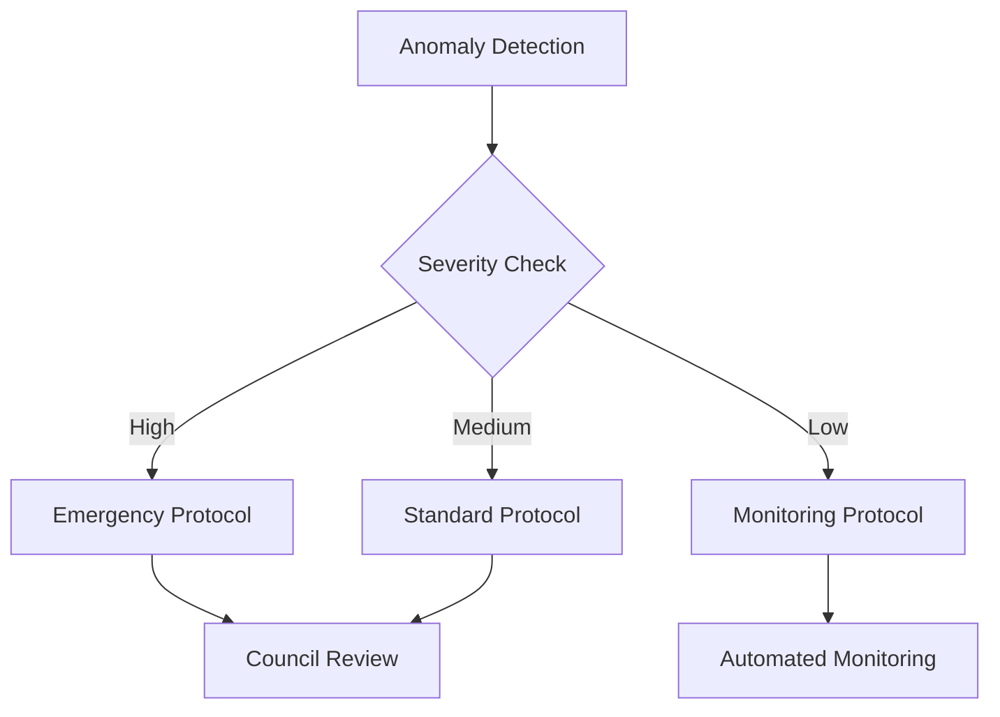

# Temporal Paradox Resolution Network (TPRN)

## System Architecture Overview

A decentralized platform for identifying, analyzing, and resolving temporal paradoxes while maintaining causal consistency across observed timelines.

### Core System Components

#### 1. Paradox Detection Framework
```
├── Temporal Anomaly Sensors
│   ├── Causality Violation Detectors
│   ├── Timeline Consistency Monitors
│   └── Entropy Measurement Systems
└── Analysis Pipeline
    ├── Pattern Recognition
    ├── Paradox Classification
    └── Severity Assessment
```

#### 2. Smart Contract Infrastructure
```solidity
contract ParadoxResolution {
    struct Anomaly {
        uint256 temporalID;
        uint8 severityLevel;
        address reporter;
        string[] resolutionProposals;
        bool isResolved;
    }
    
    struct Resolution {
        uint256 proposalID;
        address proposer;
        uint256 stakingAmount;
        uint8 consensusLevel;
        bool implemented;
    }
    
    mapping(uint256 => Anomaly) public anomalies;
    mapping(uint256 => Resolution) public resolutions;
}
```

#### 3. Simulation Engine
- Quantum-based temporal modeling
- Multi-timeline consistency verification
- Causality chain preservation algorithms
- Resolution impact assessment

### Governance Framework

#### Temporal Ethics Council
- Composition: Physicists, philosophers, ethicists
- Responsibility: Protocol oversight and ethical guidelines
- Decision-making: Multi-signature consensus mechanism

#### Resolution Protocols
1. Detection Phase
    - Automated anomaly detection
    - Human verification
    - Severity classification

2. Analysis Phase
    - Causal chain mapping
    - Impact assessment
    - Timeline divergence calculation

3. Resolution Phase
    - Proposal submission
    - Stakeholder voting
    - Implementation oversight

### Economic Model

#### Token Utility
- PARA (Paradox Resolution Authority) governance token
- Staking mechanisms for resolution proposals
- Reputation-based voting weight

#### Incentive Structure
```
Resolution Rewards = Base Reward * (Severity Level * Complexity Factor)
Stake Required = Base Stake * (Impact Range * Timeline Risk)
```

### Technical Implementation

#### Smart Contract Architecture
```
├── Core Contracts
│   ├── ParadoxRegistry.sol
│   ├── ResolutionPool.sol
│   ├── GovernanceToken.sol
│   └── StakingMechanism.sol
├── Oracle Systems
│   ├── TimelineOracle.sol
│   └── ConsensusOracle.sol
└── Integration Contracts
    ├── AIController.sol
    └── SimulationInterface.sol
```

#### AI Integration Components
- Neural networks for paradox pattern recognition
- Predictive modeling for resolution outcomes
- Decision support systems for intervention strategies

#### Security Measures
1. Temporal Consistency Safeguards
    - Immutable event logging
    - Causality chain verification
    - Timeline integrity checks

2. Cryptographic Protection
    - Quantum-resistant encryption
    - Multi-signature authorization
    - Temporal hash validation

### Resolution Workflow

1. Initial Detection


2. Analysis Process
    - Timeline divergence mapping
    - Causal relationship assessment
    - Impact prediction modeling

3. Resolution Implementation
    - Stakeholder consensus building
    - Phased intervention deployment
    - Outcome verification

### Ethical Guidelines

1. Intervention Principles
    - Minimal timeline disruption
    - Preservation of free will
    - Protection of established events

2. Governance Rules
    - Transparent decision-making
    - Community participation
    - Scientific peer review

### Future Development

#### Phase 1: Foundation
- Core smart contract deployment
- Basic paradox detection systems
- Governance framework establishment

#### Phase 2: Enhancement
- AI integration
- Advanced simulation capabilities
- Cross-timeline coordination

#### Phase 3: Expansion
- Quantum computing integration
- Multi-dimensional analysis tools
- Automated resolution systems

## Conclusion

The Temporal Paradox Resolution Network represents a groundbreaking approach to managing temporal anomalies through decentralized governance and advanced technology. Its success depends on careful implementation of both technical and ethical frameworks while maintaining the integrity of causality across observed timelines.
